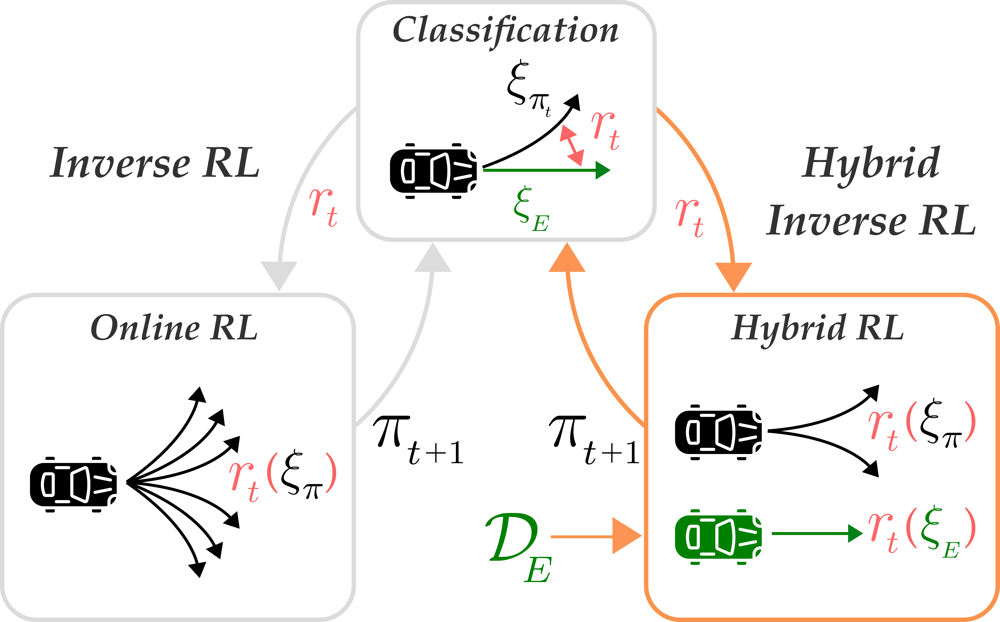

<h1 align="center">Hybrid Inverse Reinforcement Learning</h1>
<p align="center">
      
      <a href= "https://github.com/psf/black">
      </a>
</p>

This repository contains implementations of the algorithms presented in [Hybrid Inverse Reinforcement Learning.](https://arxiv.org/abs/2402.08848).
<p align="center">
  
</p>

This repository implements **hybrid training** in model-free and model-based inverse reinforcement learning. Specifically, we present two novel algorithms: `HyPE` and `HyPER`. At a high level, hybrid training is done by sampling from two buffers, one buffer that contains offline expert demonstrations and one buffer that contains on-policy transitions from the actor during policy updates. This is in contrast to standard inverse RL algorithms, that effectively ignore the expert demonstrations during policy optimization and therefore pay a higher interaction complexity than necessary.

<div class="collage">
    <div class="column" align="center">
        <div class="row" align="center">
            
            
        </div>
        <div class="row" align="center">
            
            
        </div>
    </div>
</div>


We implement `HyPE` and `HyPER` in practice through [`model_free_irl.py`](garage/algorithms/model_free_irl.py) and [`model_based_irl.py`](garage/algorithms/model_based_irl.py), respectively. More information regarding model-free/model-based inverse reinforcement learning as well as specific implementation details can be found [here](garage/algorithms/README.md).

## Table of Contents
- [Installation](#installation-hammer_and_wrench)
- [Experiments](#experiments-computer)
- [Acknowledgments](#acknowledgements-pencil)

This repository is structured as follows:
```
├── garage                      # Package folder, where we park all our hyrbids
│   ├── algorithms              # Model free and model based inverse RL implementations
│   ├── ├── model_based_irl.py  # To run HyPER
│   ├── ├── model_free_irl.py   # To run HyPE, FILTER, MM, BC-Reg
│   ├── models                  # Learner and discriminator model architectures
│   ├── ├── discriminator.py    # Single and ensemble implementation
│   ├── ├── sac.py              # Used in Mujoco locomotion exps
│   ├── ├── td3_bc.py           # Used in D4RL antmaze exps
│   ├── mbrl                    # Fork of mbrl-lib used in model based algorithms
│   ├── utils                   # Buffers, wrappers, optimizers, and logging
│   ├── config                  # Hydra config yamls
│   ├── ├── algorithm           # Algorithm-specific configs
│   ├── ├── overrides           # Environment-specific configs
│   ├── figures                 # Comparison plots
├── experts                     # Training and collecting expert demonstrations
```


## Installation :hammer_and_wrench:

Please run
```
conda create -n hyirl python=3.8.18 -y
conda activate hyirl
pip install -r requirements.txt
```
then
```
export PYTHONPATH=garage:<absolute_path_to_cwd>
export D4RL_SUPPRESS_IMPORT_ERROR=1
```
where `<absolute_path_to_cwd>` is the root directory of this repository. 

## Experiments :computer:

For all experiments, please activate the conda environment created in [Installation](#installation-hammer_and_wrench).
```
conda activate hyirl
```

### Downloading Original Data
We provide the original datasets used for the mujoco locomotion environments in the paper. These can be acquired by running
```
python experts/download_datasets.py
```
which will download the corresponding datasets for all of `Ant-v3`, `Hopper-v3`, `Humanoid-v3`, and `Walker2d-v3`. 

Since `antmaze` demonstrations are downloaded directly from [D4RL](https://github.com/Farama-Foundation/D4RL), there is no need to train an expert beforehand. Please directly run `collect_demos.py`, which will download the dataset, run some additional processing, and save all relevant keys to the `.npz` file.


### Collecting Demonstration Data
To train your own experts, please run the following script
```
python experts/train.py --env <env_name>
```
An expert will be trained for the desired environment, and a checkpoint will be saved in `experts/<env_name>`. Then, to use this checkpoint to collect new trajectories, please run the following
```
python experts/collect_demos.py --env <env_name>
```
Demonstrations will be saved as an `.npz` file containing the following entries: `observations`, `actions`, `next_observations`, `rewards`, `terminals`, `timeouts`, `seed`, `qpos`, and `qvel`. 

To extend to more experiments, simply add the new environment to the list of arguments allowed in `experts/train.py`, then run the two scripts above. Policy optimizers for the expert can also be switched out easily, provided the same is done in `experts/collect_demos.py` when loading the checkpoint. 

> [!NOTE]
> This repository currently does not support `gymnasium` versions of environments. We are working on updating our files to support newer versions of `gym` and `gymnasium`. 


### Antmaze Model Pretraining
We found that pretraining the model for model-based antmaze experiments and decreasing model update frequency helped improve stability. Thus, we also provide the script to pretrain the antmaze models, which can be modified to other environments as well. The pretrained model checkpoints used in the paper can be found under `garage\pretrained_models\<env_name>`. To create your own pretrained model, run
```
python main.py algorithm=pretrain_antmaze overrides=model_based_antmaze_diverse
```
or
```
python main.py algorithm=pretrain_antmaze overrides=model_based_antmaze_play
```

To find more details on the specific pretraining process, please reference [here](garage/algorithms#antmaze-model-pretraining).

### Reproducing Runs
To recreate the main plots seen in the paper, first run
```
cd garage
```
This repository organizes configuration files for various experiments using [hydra](https://hydra.cc/), which can be found in [`garage/config`](garage/config), and one just needs to specify the algorithm and environment they wish to run it on. For example, to run `HyPE` on `Walker2d-v3`:
```
python main.py algorithm=hype overrides=model_free_walker
```
or to run `HyPER` on `Ant-v3`:
```
python main.py algorithm=hyper overrides=model_based_ant
```

This package supports training of the following algorithms:
* MM: A baseline moment-matching algorithm that uses an integral probability metric instead of Jensen Shannon divergence as implemented by [FastIRL](https://github.com/gkswamy98/fast_irl/blob/master/learners/filt.py).
* BC-Reg: MM with an added Mean-Square Error Loss on the actor update. 
* FILTER: IRL with resets to expert states.
* HyPE: Model-free IRL with policy updates on both learner and expert state-action pairs.
* HyPE+FILTER: HyPE with resets to expert states.
* HyPER: Model-based IRL variant of HyPE, building off [LAMPS-MBRL](https://github.com/vvanirudh/LAMPS-MBRL/blob/master/MujocoSysID/mbrl/algorithms/lamps.py).

on the following environments:
* Ant-v3 (ant)
* Hopper-v3 (hopper)
* Humanoid-v3 (humanoid)
* Walker2d-v3 (walker)
* antmaze-large-diverse-v2 (maze-diverse)
* antmaze-large-play-v2 (maze-play)


> [!TIP]
> For a more detailed breakdown of the `garage` repository, please see [here](garage/README.md). For a specific breakdown of our implementations of model-free and model-based inverse reinforcement learning, please see [here](garage/algorithms/README.md).

> [!TIP] 
> All configs are filled with the exact hyperparameters used in the paper. If one wishes to adapt these algorithms to different environments or datasets, we provide a detailed list of recommendations on which parameters we recommend tuning first [here](garage/README.md/#hyperparameter-search).


### Plotting Results
Results are saved in two locations. For all config files, model checkpoints, and all other detailed logs of the run, they are saved under `garage\experiment_logs\<algorithm>\`. A copy of the final evaluation results are saved under `garage\experiment_results\`. To generate graphs for one environment, run
```
python plot.py --env <env_name>
```
You can also generate graphs for all environments that have saved results by running
```
python plot.py --all
```

## Acknowledgements :pencil:

The HyPER algorithm is built off of [LAMPS-MBRL](https://github.com/vvanirudh/LAMPS-MBRL/tree/e67085533e64201efef9a3053d9445bbabbddee8), which is a fork of [mbrl-lib](https://github.com/facebookresearch/mbrl-lib/tree/main). The HyPE algorithm is built off of [FastIRL](https://github.com/gkswamy98/fast_irl/tree/master). We also borrow components from [TD3-BC](https://github.com/sfujim/TD3_BC), [optimistic-adam](https://github.com/georgepar/optimistic-adam/tree/master), [ema-pytorch](https://github.com/lucidrains/ema-pytorch/tree/main), and [StableBaselines3](https://github.com/DLR-RM/stable-baselines3/tree/master).

## Citation

If you found this repository useful in your research, plase consider citing our paper.
```bibtex
@misc{ren2024hybrid,
      title={Hybrid Inverse Reinforcement Learning}, 
      author={Juntao Ren and Gokul Swamy and Zhiwei Steven Wu and J. Andrew Bagnell and Sanjiban Choudhury},
      year={2024},
      eprint={2402.08848},
      archivePrefix={arXiv},
      primaryClass={cs.LG}
}
```

For any questions regarding this repository or paper, please feel free to contact jlr429 [at] cornell [dot] edu or gswamy [at] cmu [dot] edu.

***
[[Top](#hybrid-inverse-reinforcement-learning)]
